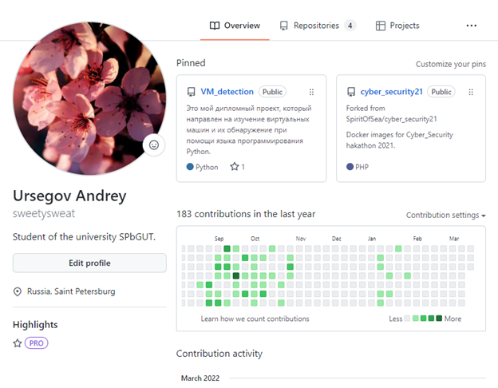

# netcracker_homework_git
### TASK 1
1. Завести аккаунт на gitlab/github.
---
<pre>Воспользуемся уже имеющимся аккаунтом на github.</pre>

2. Создать новый удаленный репозиторий.
---
<pre>Для этого нажем на кнопку "Создать новый проект".</pre>

3. Установить Git на локальную машину.
---
<pre>Git уже установлен, поэтому рассмотрим установленную версию.</pre>
