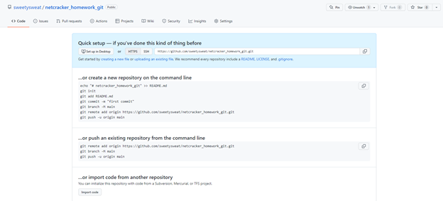
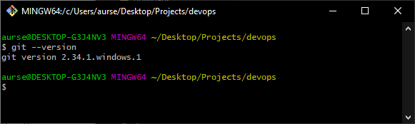

# netcracker_homework_git
### TASK 1
1. Завести аккаунт на gitlab/github.
---
  Воспользуемся уже имеющимся аккаунтом на github.
  
2. Создать новый удаленный репозиторий.
---
  Для этого нажем на кнопку "Создать новый проект".
  
3. Установить Git на локальную машину.
---
  Git уже установлен, поэтому рассмотрим установленную версию.
  