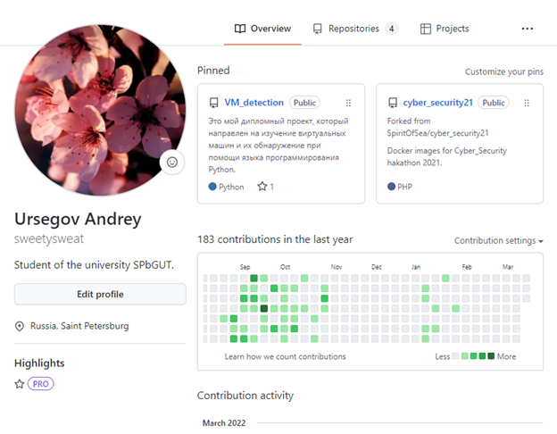
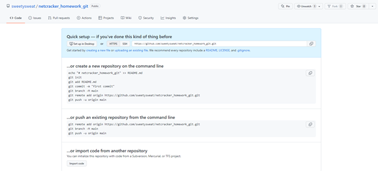
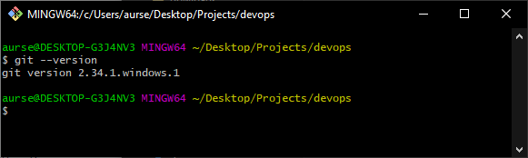
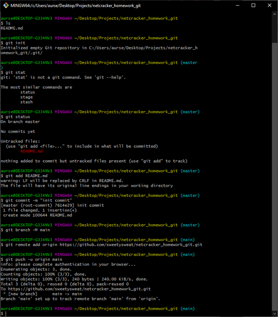
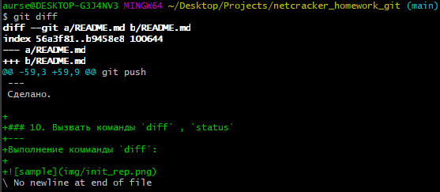
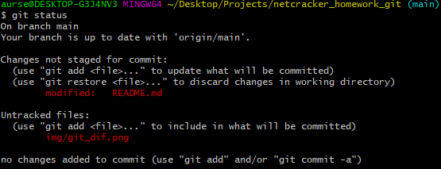
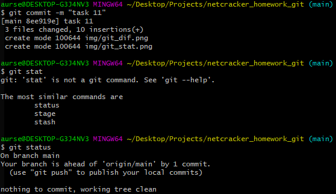

## TASK 1
### 1. Завести аккаунт на gitlab/github.
---
Воспользуемся уже имеющимся аккаунтом на github.


### 2. Создать новый удаленный репозиторий.
---
Для этого нажем на кнопку "Создать новый проект".


### 3. Установить Git на локальную машину.
---
Git уже установлен, поэтому рассмотрим установленную версию.


### 4. Инициализировать локальный репозиторий.
---
Для выполнения данного пункта воспользуемся предложенными командами.
```
echo "# netcracker_homework_git" >> README.md
git init
git add -A
git commit -m "init commit"
git branch -M main
git remote add origin https://github.com/sweetysweat/netcracker_homework_git.git
git push -u origin main
```
Пример команд:



### 5. Связать локальный репозиторий с удаленным.
---
Уже связали на пункте 4.

### 6. Описать ранее проделанные шаги в виде TASK1.MD файла с указанием выполненных комманд.
---
Сделано.

### 7. Закоммитить файл в локальный репозиторий.
---
Пример этого описан на рисунке выше.
Пример команд:

```
git add -A
git commit -m "First Task"
```

### 8. Сделать push в удаленный репозиторий. Зайти на страницу репозитория gitlab/github, убедиться в появлении изменений.
```
git push
```
В репозитории видно, что все выполнено успешно.

### 9. Дописать шаши 7-8 в файл TASK1.MD.
---
Сделано.


### 10. Вызвать команды `diff` , `status`
---
Выполнение комманды `diff`:



Выполнение комманды `status`:



### 11. Закоммитить изменения, снова проверить статус.
---


### 12. Сделать `push` в удаленный репозиторий.
---
Результат можно увидеть в самом git.

---
"Задание успешно выполнено!:)"