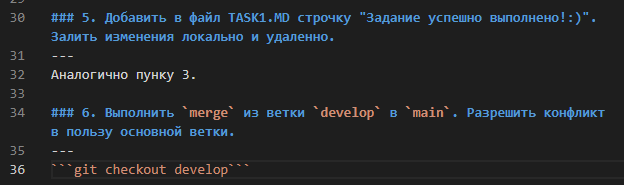
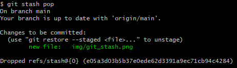

## TASK 3

### 1. Изучить команду git stash
---

### 2. Переключиться на бранч `main`.
---

Сделаем это с помощью команды: `git checkout main`

### 3. Именить TASK2.MD, дописав в него "PS Я буду делать задание 3".
---

### 4. Добавить изменения в Staging Area.
---

Добавим все изменения с помощью след. команды: `git add -A`

### 5. Вызвать git stash.
---

### 6. Вызвать git stash list и git status
---

### 7. Переключиться на ветку develop.
---

`git checkout develop`

### 8. Убедиться, что файл TASK2.MD не содержит изменений.
---

### 9. Добавить файл TASK3.MD с описанием проделанной работы.
---

Done.

### 10. Закомитить изменения.
---

`git add -A`
`git commit -m "<какой-то текст>"`

### 11. Переключиться на `master`.
---

`git checkout main`

### 12. Вернуть stash изменения TASK2.MD назад.
---

`git stash pop`

### 13. Закомитиь изменения.
---

Воспользуемся предыдущими командами.

### 14. Смержить develop в master.
---

`git merge develop`

### 15. Дописать в TASK3.MD проделанные шаги
---

done